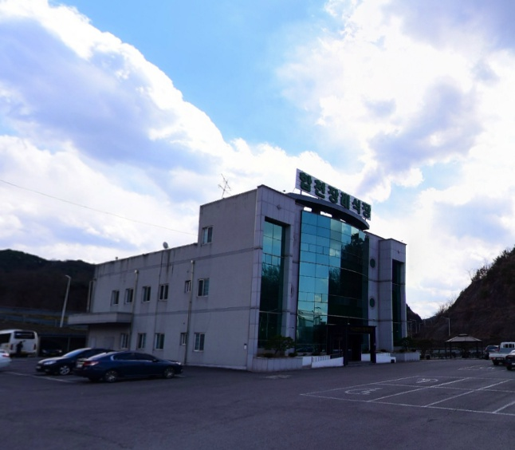

# 카카오 API 재검색 보고서

**생성일시**: 2025. 12. 23. 오후 1:40:44

## 📊 요약

| 구분 | 개수 |
|------|------|
| 처리 대상 (네이버 실패) | 72 |
| 카카오 API 성공 | 49 |
| 카카오 API 실패 | 23 |
| DB 업로드 성공 | 49 |

## ⚠️ 카카오 검색도 실패한 시설 (23개)

| 시설명 | 주소 | 전화번호 |
|--------|------|----------|
| 수원덕산병원장례식장 | 경기도 수원시 권선구 서부로 1670번길 9 B2층 장례식장 (고색동) | 031-686-2900 |
| 동두천중앙성모장례식장 | 경기도 동두천시 동광로 53 (생연동) | 031-862-4949 |
| 뉴대성병원장례식장(구 DS병원장례식장) | 경기도 부천시 원미구 부흥로 377뉴대성병원장례식장 (심곡동, DS병원) | 032-666-1002 |
| 웅상중앙병원장례식장 | 경상남도 양산시 서창로 59 (명동) | 055-912-4440 |
| 합 | 경상남도 합천군 대양면 대야로 737-20 (정양리) | 055-931-4464 |
| 거창적십자병원장례식장 | 경상남도 거창군 거창읍 중앙로 91 (상림리, 거창적십자병원) | 055-944-4482 |
| 남해병원장례식장 | 경상남도 남해군 남해읍 화전로 175 (아산리) | 055-863-5444 |
| 김해복음병원장례식장 | 경상남도 김해시 활천로 33,지하1층김해복음병원장례식장 (삼정동) | 055-330-9999 |
| 고성장례식장화라주식회사 | 경상남도 고성군 고성읍 상정대로 390 (교사리) | 055-672-5000 |
| 의령사랑병원장례식장 | 경상남도 의령군 의령읍 의합대로 105-8 (무전리) | 055-572-3900 |
| 의성성심요양병원장례식장 | 경상북도 의성군 금성면 탑리길 8-2 (대리리) | 054-833-4479 |
| 영주적십자병원장례식장 | 경상북도 영주시 대학로 327 (가흥동, 영주적십자병원) | 054-630-0128 |
| (유)브이아이피장례타운 | 광주광역시 서구 풍서좌로 237 (매월동) | 062-521-4444 |
| (주)수요양병원장례식장 | 부산광역시 부산진구 동평로 401,지하1층,지하2층 (양정동) | 051-853-1024 |
| 목포현대병원장례식장 | 전라남도 목포시 용당로 322-1 (용해동) | 061-270-9708 |
| 목포기독병원장례식장 | 전라남도 목포시 백년대로 303 (상동) | 061-283-4444 |
| 완도대성병원장례식장 | 전라남도 완도군 완도읍 청해진동로 63 (가용리) | 061-554-4456 |
| 나주중앙요양병원장례식장 | 전라남도 나주시 영산로 5406 (성북동) | 061-333-0444 |
| 유림장례식장 | 전라북도 정읍시 명덕로 54 (연지동, 유림웨딩홀) | 063-534-4444 |
| 전주고려병원장례식장 | 전라북도 전주시 덕진구 안덕원로 367 (산정동) | 063-242-9944 |
| 합자회사 서서천장례문화원 | 충청남도 서천군 비인면 충서로 862 (선도리) | 041-952-7778 |
| 충주기독장례식장 | 충청북도 충주시 성남2길 7 (성남동) | 043-844-4460 |
| 의)증평휴장례식장 | 충청북도 증평군 증평읍 중앙로 114지하1층 (초중리) | 043-838-6663 |

