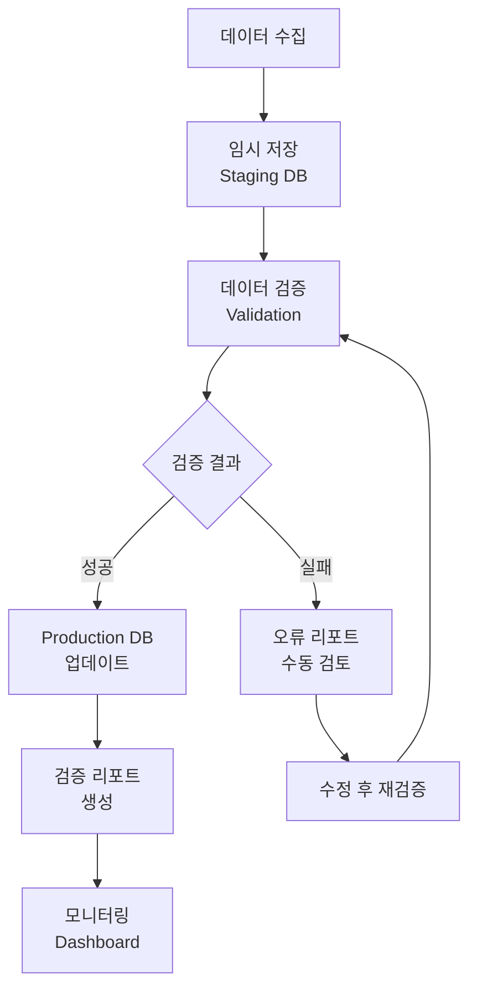

# 상조 데이터 자동 수집-검증-업데이트 파이프라인 설계

## 🔄 전체 워크플로우



---

## 📁 데이터베이스 구조

### 1. Staging DB (임시 저장)
```sql
-- 수집된 원본 데이터 임시 저장
CREATE TABLE staging_sangjo_raw (
  id UUID PRIMARY KEY DEFAULT gen_random_uuid(),
  source VARCHAR(50) NOT NULL,           -- 'crawler', 'api', 'manual'
  source_url TEXT,                        -- 출처 URL
  company_name VARCHAR(100) NOT NULL,
  data_type VARCHAR(50) NOT NULL,         -- 'product', 'image', 'description', 'price'
  raw_data JSONB NOT NULL,               -- 원본 데이터
  collected_at TIMESTAMP DEFAULT NOW(),
  processing_status VARCHAR(20) DEFAULT 'pending', -- 'pending', 'validating', 'validated', 'failed'
  validation_errors JSONB,               -- 검증 오류 목록
  retry_count INTEGER DEFAULT 0
);

-- 인덱스
CREATE INDEX idx_staging_status ON staging_sangjo_raw(processing_status);
CREATE INDEX idx_staging_company ON staging_sangjo_raw(company_name);
CREATE INDEX idx_staging_type ON staging_sangjo_raw(data_type);
```

### 2. Validation Queue (검증 대기열)
```sql
-- 검증 작업 큐
CREATE TABLE validation_queue (
  id UUID PRIMARY KEY DEFAULT gen_random_uuid(),
  staging_id UUID REFERENCES staging_sangjo_raw(id),
  validation_type VARCHAR(50) NOT NULL,   -- 'schema', 'content', 'image', 'price'
  priority INTEGER DEFAULT 5,             -- 1(긴급) ~ 10(낮음)
  created_at TIMESTAMP DEFAULT NOW(),
  started_at TIMESTAMP,
  completed_at TIMESTAMP,
  result JSONB,
  status VARCHAR(20) DEFAULT 'queued'     -- 'queued', 'processing', 'completed', 'failed'
);
```

### 3. Data Audit Log (변경 이력)
```sql
-- 모든 데이터 변경 로깅
CREATE TABLE sangjo_data_audit (
  id UUID PRIMARY KEY DEFAULT gen_random_uuid(),
  table_name VARCHAR(50) NOT NULL,
  record_id UUID NOT NULL,
  action VARCHAR(20) NOT NULL,            -- 'INSERT', 'UPDATE', 'DELETE'
  old_data JSONB,
  new_data JSONB,
  changed_by VARCHAR(100),                -- 'system', 'admin', 'api'
  change_reason TEXT,
  created_at TIMESTAMP DEFAULT NOW()
);

-- 인덱스
CREATE INDEX idx_audit_table_record ON sangjo_data_audit(table_name, record_id);
CREATE INDEX idx_audit_created ON sangjo_data_audit(created_at);
```

---

## 🔧 파이프라인 컴포넌트

### 1. 데이터 수집기 (Collector)

#### 파일: `scripts/sangjo/pipeline/collector.py`
```python
import asyncio
import json
from datetime import datetime
from typing import List, Dict
import httpx
from supabase import create_client

class SangjoDataCollector:
    def __init__(self):
        self.supabase = create_client(
            "https://your-project.supabase.co",
            "your-anon-key"
        )
        self.staging_table = "staging_sangjo_raw"
    
    async def collect_from_website(self, company: str, url: str) -> Dict:
        """홈페이지에서 데이터 수집"""
        async with httpx.AsyncClient() as client:
            try:
                response = await client.get(url, timeout=30.0)
                response.raise_for_status()
                
                # 크롤링 로직 (각 회사별 파서)
                raw_data = await self.parse_company_page(company, response.text)
                
                # Staging DB에 저장
                await self.save_to_staging({
                    "source": "crawler",
                    "source_url": url,
                    "company_name": company,
                    "data_type": "product",
                    "raw_data": raw_data
                })
                
                return {"status": "success", "count": len(raw_data.get("products", []))}
                
            except Exception as e:
                await self.save_to_staging({
                    "source": "crawler",
                    "source_url": url,
                    "company_name": company,
                    "data_type": "error",
                    "raw_data": {"error": str(e)},
                    "processing_status": "failed"
                })
                return {"status": "error", "message": str(e)}
    
    async def save_to_staging(self, data: Dict):
        """Staging DB에 저장"""
        self.supabase.table(self.staging_table).insert(data).execute()
    
    async def parse_company_page(self, company: str, html: str) -> Dict:
        """회사별 HTML 파싱"""
        parsers = {
            "프리드라이프상조": self.parse_freedlife,
            "교원라이프": self.parse_kyowon,
            "예다함상조": self.parse_yedahm,
            "본인상조": self.parse_boram
        }
        
        parser = parsers.get(company)
        if parser:
            return await parser(html)
        return {}
```

### 2. 데이터 검증기 (Validator)

#### 파일: `scripts/sangjo/pipeline/validator.py`
```python
from typing import Dict, List, Tuple
import json
from dataclasses import dataclass

@dataclass
class ValidationResult:
    is_valid: bool
    errors: List[str]
    warnings: List[str]
    normalized_data: Dict

class SangjoDataValidator:
    def __init__(self):
        self.rules = self.load_validation_rules()
    
    def load_validation_rules(self) -> Dict:
        """검증 규칙 로드"""
        return {
            "product": {
                "required_fields": ["name", "price", "description"],
                "price_range": {"min": 100000, "max": 10000000},
                "name_length": {"min": 2, "max": 100}
            },
            "image": {
                "allowed_formats": ["jpg", "jpeg", "png", "webp"],
                "max_size_mb": 5,
                "min_dimensions": {"width": 400, "height": 400}
            },
            "description": {
                "min_length": 20,
                "max_length": 500,
                "forbidden_words": ["미정", "준비중", "TBD"]
            }
        }
    
    async def validate(self, data_type: str, raw_data: Dict) -> ValidationResult:
        """데이터 검증"""
        errors = []
        warnings = []
        normalized = {}
        
        if data_type == "product":
            return await self.validate_product(raw_data)
        elif data_type == "image":
            return await self.validate_image(raw_data)
        elif data_type == "description":
            return await self.validate_description(raw_data)
        
        return ValidationResult(False, ["Unknown data type"], [], {})
    
    async def validate_product(self, data: Dict) -> ValidationResult:
        """상품 데이터 검증"""
        errors = []
        warnings = []
        normalized = {}
        
        rules = self.rules["product"]
        
        # 필수 필드 체크
        for field in rules["required_fields"]:
            if field not in data or not data[field]:
                errors.append(f"Required field missing: {field}")
        
        # 가격 검증
        if "price" in data:
            price = self.normalize_price(data["price"])
            if price < rules["price_range"]["min"]:
                errors.append(f"Price too low: {price}")
            elif price > rules["price_range"]["max"]:
                errors.append(f"Price too high: {price}")
            normalized["price"] = price
        
        # 상품명 길이 검증
        if "name" in data:
            name_len = len(data["name"])
            if name_len < rules["name_length"]["min"]:
                errors.append(f"Name too short: {name_len} chars")
            elif name_len > rules["name_length"]["max"]:
                warnings.append(f"Name too long: {name_len} chars")
            normalized["name"] = data["name"].strip()
        
        # 설명 정제
        if "description" in data:
            normalized["description"] = self.clean_description(data["description"])
        
        return ValidationResult(
            is_valid=len(errors) == 0,
            errors=errors,
            warnings=warnings,
            normalized_data=normalized
        )
    
    async def validate_image(self, data: Dict) -> ValidationResult:
        """이미지 데이터 검증"""
        errors = []
        warnings = []
        
        # 이미지 URL 접근 가능 여부 체크
        image_url = data.get("url") or data.get("imageUrl")
        if not image_url:
            errors.append("Image URL missing")
            return ValidationResult(False, errors, warnings, {})
        
        # TODO: 실제 이미지 다운로드 및 검증
        # - 크기 체크
        # - 형식 체크
        # - 해상도 체크
        # - 중복 이미지 체크 (해시)
        
        return ValidationResult(len(errors) == 0, errors, warnings, {"url": image_url})
    
    def normalize_price(self, price) -> int:
        """가격 정규화"""
        if isinstance(price, str):
            # "3,000,000원" -> 3000000
            return int(price.replace(",", "").replace("원", "").strip())
        return int(price)
    
    def clean_description(self, desc: str) -> str:
        """설명 정제"""
        # HTML 태그 제거
        import re
        desc = re.sub(r'<[^>]+>', '', desc)
        # 연속된 공백 제거
        desc = re.sub(r'\s+', ' ', desc)
        return desc.strip()
```

### 3. 데이터 업데이트 (Updater)

#### 파일: `scripts/sangjo/pipeline/updater.py`
```python
from typing import Dict, List
from datetime import datetime
import json

class SangjoDataUpdater:
    def __init__(self, supabase_client):
        self.supabase = supabase_client
        self.batch_size = 100
    
    async def update_products(self, validated_data: List[Dict]):
        """검증된 상품 데이터 업데이트"""
        for item in validated_data:
            try:
                # 기존 데이터 확인
                existing = self.supabase.table("products").select("*").eq(
                    "company_id", item["company_id"]
                ).eq("name", item["name"]).execute()
                
                if existing.data:
                    # 업데이트
                    old_data = existing.data[0]
                    await self.update_record("products", old_data["id"], item)
                else:
                    # 새로 삽입
                    await self.insert_record("products", item)
                    
            except Exception as e:
                await self.log_error("update_products", item, str(e))
    
    async def update_record(self, table: str, record_id: str, new_data: Dict):
        """레코드 업데이트 + Audit Log"""
        # 기존 데이터 조회
        old_data = self.supabase.table(table).select("*").eq("id", record_id).execute()
        
        if old_data.data:
            # 변경사항 체크
            changes = self.detect_changes(old_data.data[0], new_data)
            
            if changes:
                # 업데이트 실행
                self.supabase.table(table).update(new_data).eq("id", record_id).execute()
                
                # Audit Log 기록
                await self.log_audit(table, record_id, "UPDATE", old_data.data[0], new_data)
    
    async def insert_record(self, table: str, data: Dict):
        """새 레코드 삽입 + Audit Log"""
        result = self.supabase.table(table).insert(data).execute()
        
        if result.data:
            await self.log_audit(table, result.data[0]["id"], "INSERT", None, data)
    
    def detect_changes(self, old: Dict, new: Dict) -> List[str]:
        """변경된 필드 감지"""
        changes = []
        for key in new:
            if key in old and old[key] != new[key]:
                changes.append(key)
        return changes
    
    async def log_audit(self, table: str, record_id: str, action: str, 
                       old_data: Dict, new_data: Dict):
        """Audit Log 기록"""
        self.supabase.table("sangjo_data_audit").insert({
            "table_name": table,
            "record_id": record_id,
            "action": action,
            "old_data": old_data,
            "new_data": new_data,
            "changed_by": "system",
            "change_reason": "automated_pipeline"
        }).execute()
```

---

## ⚙️ 자동화 설정

### 1. GitHub Actions Workflow

#### 파일: `.github/workflows/sangjo-data-pipeline.yml`
```yaml
name: Sangjo Data Pipeline

on:
  schedule:
    # 매일 새벽 2시 실행
    - cron: '0 2 * * *'
  workflow_dispatch:  # 수동 실행 가능

jobs:
  collect:
    runs-on: ubuntu-latest
    steps:
      - uses: actions/checkout@v3
      
      - name: Set up Python
        uses: actions/setup-python@v4
        with:
          python-version: '3.11'
      
      - name: Install dependencies
        run: |
          pip install -r scripts/sangjo/requirements.txt
      
      - name: Run Data Collector
        env:
          SUPABASE_URL: ${{ secrets.SUPABASE_URL }}
          SUPABASE_KEY: ${{ secrets.SUPABASE_KEY }}
        run: |
          python scripts/sangjo/pipeline/collector.py --mode=all
      
      - name: Run Validator
        run: |
          python scripts/sangjo/pipeline/validator.py --mode=pending
      
      - name: Run Updater
        run: |
          python scripts/sangjo/pipeline/updater.py --mode=validated
      
      - name: Generate Report
        run: |
          python scripts/sangjo/pipeline/generate_report.py --output=reports/
      
      - name: Upload Report
        uses: actions/upload-artifact@v3
        with:
          name: pipeline-report
          path: reports/
```

### 2. 로컬 개발용 스케줄러

#### 파일: `scripts/sangjo/pipeline/scheduler.py`
```python
import asyncio
import schedule
import time
from datetime import datetime

class PipelineScheduler:
    def __init__(self):
        self.collector = SangjoDataCollector()
        self.validator = SangjoDataValidator()
        self.updater = SangjoDataUpdater()
    
    async def run_collection(self):
        """데이터 수집 작업"""
        print(f"[{datetime.now()}] Starting data collection...")
        
        companies = [
            ("프리드라이프상조", "https://www.freedlife.co.kr/products"),
            ("교원라이프", "https://www.kyowonlife.co.kr/products"),
            ("예다함상조", "https://www.yedahm.com/products"),
            ("본인상조", "https://www.boramsangjo.co.kr/products")
        ]
        
        for company, url in companies:
            result = await self.collector.collect_from_website(company, url)
            print(f"  - {company}: {result}")
        
        print(f"[{datetime.now()}] Collection completed")
    
    async def run_validation(self):
        """데이터 검증 작업"""
        print(f"[{datetime.now()}] Starting validation...")
        
        # Staging에서 pending 데이터 조회
        pending = self.supabase.table("staging_sangjo_raw").select("*").eq(
            "processing_status", "pending"
        ).execute()
        
        for item in pending.data:
            result = await self.validator.validate(item["data_type"], item["raw_data"])
            
            if result.is_valid:
                # 검증 성공 - 업데이트 대기열에 추가
                self.supabase.table("staging_sangjo_raw").update({
                    "processing_status": "validated",
                    "validation_errors": None
                }).eq("id", item["id"]).execute()
            else:
                # 검증 실패
                self.supabase.table("staging_sangjo_raw").update({
                    "processing_status": "failed",
                    "validation_errors": result.errors
                }).eq("id", item["id"]).execute()
        
        print(f"[{datetime.now()}] Validation completed")
    
    async def run_update(self):
        """Production DB 업데이트"""
        print(f"[{datetime.now()}] Starting update...")
        
        # 검증 완료된 데이터 조회
        validated = self.supabase.table("staging_sangjo_raw").select("*").eq(
            "processing_status", "validated"
        ).execute()
        
        await self.updater.update_products(validated.data)
        
        # 처리 완료 표시
        for item in validated.data:
            self.supabase.table("staging_sangjo_raw").update({
                "processing_status": "completed"
            }).eq("id", item["id"]).execute()
        
        print(f"[{datetime.now()}] Update completed")
    
    def schedule_jobs(self):
        """작업 스케줄링"""
        # 매일 새벽 2시: 수집
        schedule.every().day.at("02:00").do(lambda: asyncio.run(self.run_collection()))
        
        # 매일 새벽 3시: 검증
        schedule.every().day.at("03:00").do(lambda: asyncio.run(self.run_validation()))
        
        # 매일 새벽 4시: 업데이트
        schedule.every().day.at("04:00").do(lambda: asyncio.run(self.run_update()))
        
        print("Scheduler started. Press Ctrl+C to exit.")
        
        while True:
            schedule.run_pending()
            time.sleep(60)

# 실행
if __name__ == "__main__":
    scheduler = PipelineScheduler()
    scheduler.schedule_jobs()
```

---

## 📊 모니터링 및 알림

### 1. 슬랙 알림 연동

#### 파일: `scripts/sangjo/pipeline/notifier.py`
```python
import httpx
import json
from datetime import datetime

class SlackNotifier:
    def __init__(self, webhook_url: str):
        self.webhook_url = webhook_url
    
    async def send_pipeline_summary(self, stats: Dict):
        """파이프라인 실행 결과 알림"""
        message = {
            "blocks": [
                {
                    "type": "header",
                    "text": {
                        "type": "plain_text",
                        "text": "📊 상조 데이터 파이프라인 실행 완료"
                    }
                },
                {
                    "type": "section",
                    "fields": [
                        {"type": "mrkdwn", "text": f"*수집:*\n{stats['collected']}개"},
                        {"type": "mrkdwn", "text": f"*검증 성공:*\n{stats['validated']}개"},
                        {"type": "mrkdwn", "text": f"*검증 실패:*\n{stats['failed']}개"},
                        {"type": "mrkdwn", "text": f"*업데이트:*\n{stats['updated']}개"}
                    ]
                },
                {
                    "type": "context",
                    "elements": [
                        {"type": "mrkdwn", "text": f"실행 시간: {datetime.now().strftime('%Y-%m-%d %H:%M')}"}
                    ]
                }
            ]
        }
        
        async with httpx.AsyncClient() as client:
            await client.post(self.webhook_url, json=message)
    
    async def send_error_alert(self, error: str, context: Dict):
        """오류 발생 시 알림"""
        message = {
            "blocks": [
                {
                    "type": "header",
                    "text": {
                        "type": "plain_text",
                        "text": "🚨 상조 데이터 파이프라인 오류"
                    }
                },
                {
                    "type": "section",
                    "text": {
                        "type": "mrkdwn",
                        "text": f"*오류:* {error}\n*상황:* {json.dumps(context, ensure_ascii=False)}"
                    }
                }
            ]
        }
        
        async with httpx.AsyncClient() as client:
            await client.post(self.webhook_url, json=message)
```

### 2. 모니터링 대시보드

#### 파일: `scripts/sangjo/pipeline/dashboard.html` (간단한 웹 대시보드)
```html
<!DOCTYPE html>
<html>
<head>
    <title>상조 데이터 파이프라인 모니터링</title>
    <style>
        body { font-family: Arial, sans-serif; margin: 20px; }
        .stats { display: grid; grid-template-columns: repeat(4, 1fr); gap: 20px; margin: 20px 0; }
        .stat-card { background: #f5f5f5; padding: 20px; border-radius: 8px; text-align: center; }
        .stat-value { font-size: 32px; font-weight: bold; color: #333; }
        .stat-label { color: #666; margin-top: 5px; }
        .success { color: #4CAF50; }
        .error { color: #f44336; }
        table { width: 100%; border-collapse: collapse; margin-top: 20px; }
        th, td { padding: 12px; text-align: left; border-bottom: 1px solid #ddd; }
        th { background: #f5f5f5; }
    </style>
</head>
<body>
    <h1>📊 상조 데이터 파이프라인 모니터링</h1>
    
    <div class="stats">
        <div class="stat-card">
            <div class="stat-value" id="collected">-</div>
            <div class="stat-label">수집된 데이터</div>
        </div>
        <div class="stat-card">
            <div class="stat-value success" id="validated">-</div>
            <div class="stat-label">검증 성공</div>
        </div>
        <div class="stat-card">
            <div class="stat-value error" id="failed">-</div>
            <div class="stat-label">검증 실패</div>
        </div>
        <div class="stat-card">
            <div class="stat-value" id="updated">-</div>
            <div class="stat-label">업데이트 완료</div>
        </div>
    </div>
    
    <h2>최근 오류</h2>
    <table id="errors-table">
        <thead>
            <tr>
                <th>시간</th>
                <th>회사</th>
                <th>유형</th>
                <th>오류</th>
            </tr>
        </thead>
        <tbody></tbody>
    </table>
    
    <script>
        // Supabase에서 실시간 데이터 로드
        async function loadStats() {
            const response = await fetch('/api/pipeline/stats');
            const data = await response.json();
            
            document.getElementById('collected').textContent = data.collected;
            document.getElementById('validated').textContent = data.validated;
            document.getElementById('failed').textContent = data.failed;
            document.getElementById('updated').textContent = data.updated;
        }
        
        loadStats();
        setInterval(loadStats, 60000); // 1분마다 갱신
    </script>
</body>
</html>
```

---

## 🚀 실행 방법

### 1. 초기 설정
```bash
# 1. 디렉토리 구조 생성
mkdir -p scripts/sangjo/pipeline
mkdir -p scripts/sangjo/data
mkdir -p reports

# 2. 가상환경 설정
python -m venv venv
source venv/bin/activate  # Windows: venv\Scripts\activate

# 3. 패키지 설치
pip install supabase-py httpx beautifulsoup4 schedule python-dotenv

# 4. 환경 변수 설정
cat > .env << EOF
SUPABASE_URL=https://your-project.supabase.co
SUPABASE_KEY=your-service-role-key
SLACK_WEBHOOK_URL=https://hooks.slack.com/services/xxx
EOF
```

### 2. 데이터베이스 마이그레이션
```bash
# Supabase SQL Editor에서 실행
psql $DATABASE_URL -f scripts/sangjo/migrations/001_create_pipeline_tables.sql
```

### 3. 수동 실행
```bash
# 수집만 실행
python scripts/sangjo/pipeline/collector.py --company=프리드라이프상조

# 검증만 실행
python scripts/sangjo/pipeline/validator.py --status=pending

# 업데이트만 실행
python scripts/sangjo/pipeline/updater.py --dry-run

# 전체 파이프라인 실행
python scripts/sangjo/pipeline/scheduler.py --once
```

### 4. 자동화 실행
```bash
# 백그라운드에서 스케줄러 실행
nohup python scripts/sangjo/pipeline/scheduler.py > logs/scheduler.log 2>&1 &

# 또는 Docker로 실행
docker-compose -f scripts/sangjo/docker-compose.yml up -d
```

---

## 📈 성과 지표 (KPI)

| 지표 | 목표 | 측정 방법 |
|------|------|----------|
| **데이터 수집 성공률** | >95% | 수집 시도 대비 성공 비율 |
| **검증 통과율** | >90% | 수집 데이터 대비 검증 성공 비율 |
| **업데이트 지연 시간** | <24시간 | 수집 ~ Production 반영 시간 |
| **데이터 정확도** | >98% | 샘플링 검증 결과 |
| **파이프라인 가동률** | >99% | 정상 실행 일수 / 전체 일수 |

---

## 🔒 보안 및 안전장치

### 1. 데이터 보호
- **Staging DB**: Production과 분리된 환경
- **암호화**: 민감 데이터 암호화 저장
- **접근 제어**: 최소 권한 원칙 적용

### 2. 안전장치
- **Rate Limiting**: 크롤링 시 요청 간격 1초 이상
- **백업**: Staging 데이터 일일 백업
- **롤백**: 잘못된 업데이트 시 1-click 롤백
- **Circuit Breaker**: 연속 오류 시 자동 중단

### 3. 모니터링
- **실시간 로깅**: 모든 작업 로그 저장
- **알림**: 오류 발생 시 즉시 슬랙 알림
- **대시보드**: 실시간 파이프라인 상태 확인

---

**작성일**: 2026-02-12  
**버전**: 1.0  
**다음 단계**: 상세 구현 및 테스트
