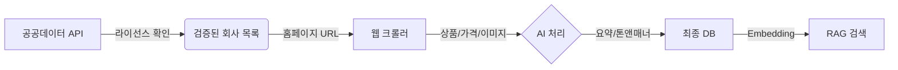

# 상조 데이터 실전 수집 가이드 (Hybrid Approach)

> **목표**: 상조 데이터를 API 검증, 홈페이지 크롤링, AI 생성으로 **신뢰성 + 최신성 + 생산성**을 모두 확보합니다.
> **핵심 전략**: API (검증) → Crawling (수집) → AI (생산)

---

## 1. 🏗️ 전체 구조 (Architecture)

## 2. 🚀 단계별 실행 가이드

### Step 1: 기본 정보 수집 및 검증 (API)
**목적**: "진짜 영업 중인 회사인가?" 확인. 폐업/등록취소 업체 필터링.

1.  **공공데이터포털 활용**:
    *   **공정거래위원회_선불식 할부거래사업자 정보** API 사용. (또는 엑셀 다운로드)
    *   **필수 확인 항목**: `상호명`, `대표자`, `주소`, `전화번호`, `영업상태`(정상/폐업).
    *   **실행**: `scripts/sangjo/verify_license.ts` (신규 작성)
        *   입력: 회사명 리스트
        *   출력: 검증된 회사 목록 JSON

### Step 2: 상세 상품 수집 (Crawling)
**목적**: "얼마인가? 무엇을 주는가?" (API에는 없는 정보).

1.  **타겟 사이트**:
    *   **메이저 5사**: 프리드라이프, 보람상조, 교원, 예다함, 더리본. (점유율 80% 커버)
    *   **중소형**: 홈페이지 구조가 제각각이므로 **LLM 기반 스크래퍼**(`Firecrawl` or `Jina AI Reader`) 권장.
2.  **수집 항목**:
    *   `상품명` (예: 프리드 399)
    *   `월 납입금` (예: 39,900원 x 100회)
    *   `제공 서비스` (장례지도사 n명, 도우미 n명, 관/수의 등급)
    *   `결합 혜택` (가전제품 등 - *주의: 장례 서비스와 분리하여 저장*)
3.  **실행**: `scripts/sangjo/crawl_products.ts` (Playwright + Cheerio)

### Step 3: 데이터 가공 및 생성 (AI)
**목적**: "복잡한 약관을 쉽게 설명하자." (UX 차별화).

1.  **AI 작업 목록**:
    *   **상품 요약**: "이 상품은 **소규모 가족장**에 적합하며, **월 2만원대**로 부담 없이 시작할 수 있어요." (톤앤매너 적용)
    *   **FAQ 생성**: 약관 텍스트 -> "중도 해지 시 환급금은?", "양도 가능한가요?" 질문/답변 생성.
    *   **비교 포인트**: "A상품 대비 B상품은 **수의 등급**이 높습니다." 태그 생성.
2.  **실행**: `scripts/sangjo/enrich_with_ai.ts` (OpenAI/Claude API) or **NotebookLM**

---

## 3. 🛠️ 실용적 도구 추천

| 단계 | 도구 | 용도 | 비용 |
|---|---|---|---|
| **검증** | **공정위 API / Excel** | 기본 신뢰도 확보 | 무료 |
| **수집** | **Firecrawl / Jina Reader** | 복잡한 HTML -> Markdown 변환 (LLM 친화적) | 소액 유료 / 무료 |
| **가공** | **Gemini 1.5 Flash / Claude 3 Haiku** | 대량 텍스트 요약 및 구조화 (가성비) | 저렴 |
| **DB** | **Supabase** | `pgvector`로 AI 검색 연동까지 한 번에 | - |

---

## 4. ⚠️ 주의사항 및 팁

1.  **이미지 저작권**:
    *   홈페이지 이미지는 **저작권** 문제 소지가 큼.
    *   팁: 회사 로고는 OK. 상품 이미지는 **AI 생성(Midjourney/DALL-E)**로 "고품질 추상 이미지"(분위기 연출)를 사용하는 것이 안전하고 통일감 있음.
2.  **가격 변동성**:
    *   상조 상품은 가격이 자주 바뀌지 않으나, **프로모션/사은품**은 자주 바뀜.
    *   팁: 가격 정보 옆에 `기준일: 2024.02.XX`를 반드시 표기.
3.  **법적 고지**:
    *   "이 정보는 참고용이며, 정확한 계약 조건은 해당 회사 홈페이지를 확인하세요." 문구 필수.

---

## 5. 바로 시작하기 (Action Items)

1.  [ ] **[API]** 공정위 데이터 엑셀 다운로드 (가장 빠름) -> `data/sangjo_license_list.csv` 저장.
2.  [ ] **[Code]** `collect_sangjo_prices.ts` 작성 (주요 5개사 URL 하드코딩 시작).
3.  [ ] **[AI]** 수집된 텍스트를 LLM에 넣어 `summary_json` 생성 프롬프트 테스트.
